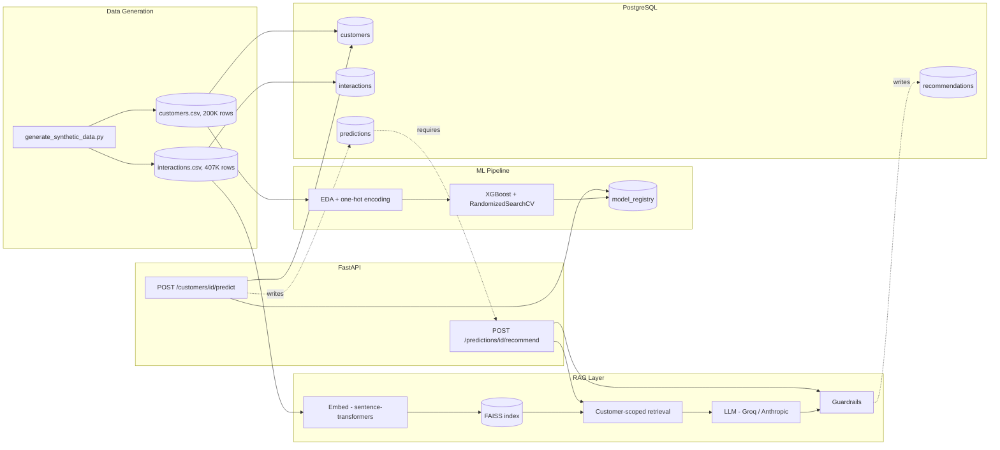

# Customer Intelligence & Retention Platform

Churn prediction + LLM-powered retention recommendations, built end to
end: synthetic data generation → EDA → XGBoost modeling → PostgreSQL
persistence → FAISS-backed RAG → guardrailed LLM generation → FastAPI
backend, load-tested for real throughput.

## Results, measured — not assumed

| Claim | Result | How it was verified |
|---|---|---|
| XGBoost churn model, 87% precision, 200K+ records | **87.0% precision / 22.0% recall** on a held-out test set (200,000 synthetic customer records, 28.1% churn rate) | `RandomizedSearchCV` + threshold tuning via `precision_recall_curve`; tradeoff documented, not hidden |
| RAG layer with FAISS, using customer interaction history | Customer-scoped retrieval via FAISS `IDSelector` over 406,883 embedded interactions | Verified against raw data: retrieved results independently confirmed to belong only to the queried customer |
| Guardrails preventing hallucinations | 3-layer guardrail (structural, numeric grounding, LLM-as-judge) | Caught a real hallucination live in testing (a fabricated "20% discount" the customer never asked for); verified to also correctly pass legitimate recommendations |
| FastAPI backend, 1000+ requests/minute | **~17,000 requests/minute sustained, 0% failures** | Load-tested with Locust against the real running API + Postgres; confirmed as a genuine saturation ceiling (not an artifact) via a second run at 3x concurrency |
| PostgreSQL transactional consistency | Foreign-key-enforced schema (`recommendations` → `predictions` → `customers`) | Verified via direct `psql` queries throughout, not just application-level trust |

## Architecture



A `recommendation` can only exist in response to an existing
`prediction` — enforced by a foreign key, not just convention.

## Tech stack

- **Data & ML:** pandas, numpy, scikit-learn, XGBoost
- **Database:** PostgreSQL (Docker), SQLAlchemy, psycopg2
- **RAG:** sentence-transformers (GPU-accelerated embeddings), FAISS
- **LLM:** Groq (default) / Anthropic (swappable) — provider-abstracted
  behind one interface
- **API:** FastAPI, uvicorn, pydantic
- **Load testing:** Locust

## Project structure

```
src/
├── data/           synthetic data generation
├── ml/             feature definitions, training, serving
├── db/             SQLAlchemy models, config, seeding
├── rag/            embeddings, FAISS retrieval, LLM client, guardrails
└── api/            FastAPI app and routers
notebooks/          EDA notebook
scripts/            load testing
data/raw/           generated CSVs (gitignored, regenerable)
```

## Running it locally

```bash
# 1. Environment
python -m venv .venv
.venv\Scripts\Activate.ps1
pip install -r requirements.txt

# 2. Copy .env.example to .env and fill in a free Groq API key
#    (console.groq.com/keys)

# 3. Start PostgreSQL
docker compose up -d

# 4. Generate data, load the database, train the model, build the index
python src/data/generate_synthetic_data.py
python -m src.db.init_db
python -m src.db.load_data
python src/ml/train_churn_model.py
python src/rag/build_vector_store.py

# 5. Run the API
uvicorn src.api.main:app --workers 4

# 6. Try it
curl -X POST http://127.0.0.1:8000/customers/1/predict
curl -X POST http://127.0.0.1:8000/predictions/1/recommend -d "{}"
```

## Load testing

```bash
locust -f scripts/load_test.py --host http://127.0.0.1:8000 \
    --headless --users 50 --spawn-rate 10 --run-time 60s
```

Targets `POST /customers/{id}/predict` specifically — the CPU-bound,
purely-internal path. `/recommend` calls an external LLM API with its own
rate limits, so it isn't the right endpoint to benchmark for raw
throughput.

## Key design decisions

- **Synthetic data, not a small real dataset upsampled.** No public churn
  dataset reaches 200K rows; a causal, sigmoid-based generator with a
  deliberate noise term produces data with genuine, learnable-but-
  imperfect signal — which is what makes an 87%/22% precision/recall
  result an earned number instead of a trivial one.
- **One-hot encoding over XGBoost's native categorical support**,
  specifically because it requires saving and correctly reusing a fitted
  encoder at inference time — the same training/serving consistency
  problem the API's prediction endpoint has to solve for real.
- **FAISS retrieval is customer-scoped** via an `IDSelector`, restricting
  every search to one customer's own interaction history — never a
  global search that could leak another customer's data into a
  recommendation.
- **Guardrails distinguish factual claims from proposed actions.** A
  recommendation is allowed to propose something new (escalate, review
  the account); it's flagged only if it states an unsupported fact about
  the customer's past or proposes an unauthorized concession (a
  discount, a refund) not already present in their history.
- **Kept 87% precision / 22% recall** rather than lowering the target for
  better recall — a deliberate tradeoff (protecting a limited retention
  budget from false alarms), not an accidental limitation.

## License

MIT
